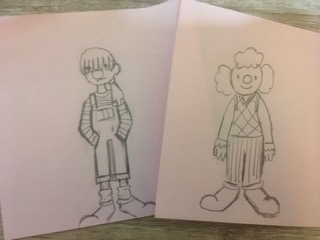

# Hi, I'm Lars

```
string name = "Lars Vlahakis"
string pronouns = "they/them"
int age = 20
int years_coding = 5
```

I am a third year Computer Engineering Student at **UCSD** with *possibly* too many interests. 

## I have experience with:
- Python
- C
- C++
- Java
- HTML

I've also taken classes in computer architecture and circuits. 

Outside of coding, I like to write, play music, knit, and read.

I also like clowns.



They are very fun to draw.

## Current Projects
- [ ] Knitting Pattern Preview
- [ ] Irish Folk Song Search

A quote I like:
> Be proud of your place in the cosmos. It is small, and yet, it is.
(from Welcome to Night Vale)

[Here's some music I like to listen to while working](https://open.spotify.com/playlist/5lFCFJkfndF0DcPcCT3zsE?si=8n3-8r-uQhSzBvSMhJAIbQ)

[Basic Info](README.md)
